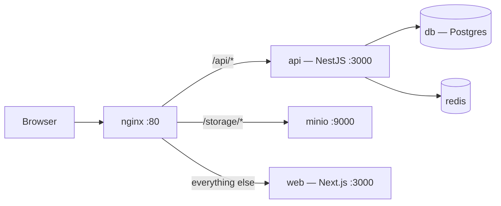
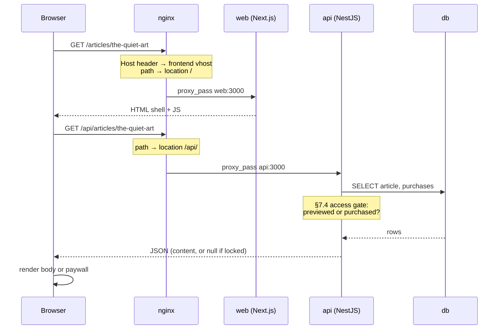
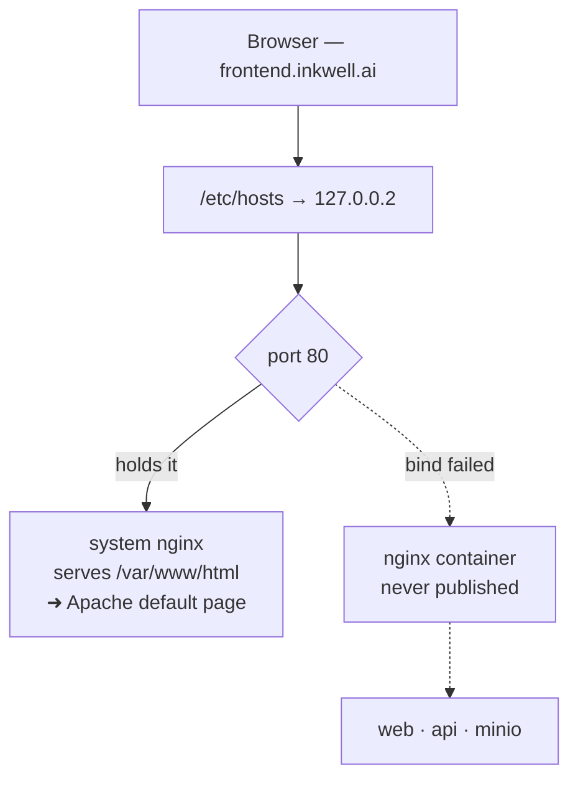

# How Inkwell actually runs

A walkthrough of nginx, Docker, and the path a request takes from the browser to
Postgres — written against the real files in this project.

`8-devops.md` is the **specification**: what the infrastructure should be. This
document is the **explainer**: how the pieces behave, why particular lines exist
in the config, and how to diagnose it when nothing loads. Read that one to know
the design; read this one to understand the machine.

---

## 1. What nginx is

Four programs run in this stack: Next.js (3000), NestJS (3000), MinIO (9000),
and a Postgres nobody outside should touch. A browser can only visit one address
at a time, and asking a user to remember which port serves which part of the site
is not a product.

nginx sits in front of all of them on a single port and routes each request to
the right one. That role has a name: a **reverse proxy**. A *forward* proxy sits
in front of clients (a corporate web filter); a *reverse* proxy sits in front of
servers. Same machinery, opposite direction.

From the browser's point of view there is one server. It never learns that four
programs exist — and that single fact is what makes cookies, CORS, and relative
URLs like `/storage/inkwell/cover.jpg` work without special cases.



---

## 2. How nginx decides where to send a request

Two questions, asked in order. Every directive in `dev.conf` serves one of them.

### First: which `server` block? (the `Host` header)

Every HTTP request carries the hostname the user typed, in a header called
`Host`. This is how one nginx on one port serves many sites: it reads that header
and picks a matching `server { }` block by its `server_name`.

`dev.conf` declares three:

| `server_name` | Proxies to | Why it exists separately |
|---|---|---|
| `frontend.inkwell.ai` | web, api, minio | The app. Everything on one origin, exactly as production behaves. |
| `backend.inkwell.ai` | api only | Swagger, curl, Postman. The browser app never uses it, so it adds no CORS surface. |
| `storage.inkwell.ai` | minio only | Image uploads. Load-bearing — see §3. |

This is also why `curl http://127.0.0.2/` returns 404 while
`curl -H 'Host: frontend.inkwell.ai' http://127.0.0.2/` returns 200: without the
header, nginx has no idea which of the three sites you meant.

### Then: which `location`? (the path)

Inside the chosen server block, nginx matches the URL path against `location`
blocks, most specific first:

```nginx
location /api/     { proxy_pass http://api:3000;   }
location /storage/ { proxy_pass http://minio:9000; }
location /         { proxy_pass http://web:3000;   }   # catch-all
```

`proxy_pass` is the whole trick: nginx opens its own connection to the upstream,
forwards the request, and streams the answer back. The browser sees a single
response from a single server.

---

## 3. Three lines in `dev.conf` that are not boilerplate

Each is there because something broke without it.

### `resolver 127.0.0.11`

**Lets nginx boot before the app does.** Written the conventional way —
`upstream web { server web:3000; }` — nginx resolves those names *once*, when it
parses the config. Since `web`, `api` and `worker` sit behind the `apps` compose
profile and are usually not running, that lookup fails and nginx exits with
`host not found in upstream`.

Passing the upstream through a **variable** in `proxy_pass` defers the lookup to
request time, using Docker's embedded DNS at that fixed address. A stopped
service then yields a clean 502 instead of a proxy that refuses to start.

### `proxy_buffering off`

**Makes streaming work.** By default nginx collects the upstream response and
forwards it in chunks. For AI chat and the notification feed — both Server-Sent
Events — that means nginx holds tokens until its buffer fills and the "typing"
effect arrives as one lump. Paired with `proxy_read_timeout 300s`, because a
generation easily outlives the 60-second default.

### `proxy_set_header Host $host`

**Keeps image uploads working.** The backend hands the browser a presigned S3
URL, and the S3 signature covers the `Host` header. Rewrite it in transit and
MinIO rejects the upload with `403 SignatureDoesNotMatch`.

This is also why `storage.inkwell.ai` must be a real hostname the *browser* can
resolve, rather than the internal `minio:9000` — no browser can resolve a
container name.

---

## 4. Images and containers

The single distinction everything else in Docker rests on.

- An **image** is a frozen filesystem plus a default command. It does not run.
  It is a build artifact — immutable and shareable, like a `.zip`.
- A **container** is one running instance of an image, with a thin writable layer
  on top. Start three containers from one image and you get three isolated
  processes sharing one read-only base. Delete a container and its writable layer
  goes with it — which is exactly why databases need volumes.

Image is to container what a *class* is to an *object*, or what an ISO is to a
booted machine.

---

## 5. How the images are built

`backend.inkwell.ai/Dockerfile` has four stages. Each consumes the last, so the
order is a real sequence.

**1. `base`** — Node 22 Alpine, pnpm enabled. Alpine because it is ~50 MB against
~350 MB for the Debian variant. Every later stage inherits from it, so the
toolchain is defined once.

**2. `deps`** — copies *only* `package.json` and the lockfile, then installs.
Only those two files, deliberately: Docker caches each instruction and reuses the
cache while its inputs are unchanged. Copying the whole source first would
invalidate the install on every code edit; this way a full `pnpm install` reruns
only when a dependency actually changes.

**3. `build`** — brings in `node_modules`, copies the source, compiles TypeScript
into `dist/`. This stage holds the compiler, the source, and every dev
dependency: hundreds of megabytes that must not ship.

**4. `runner`** — a *fresh* base, production dependencies only, plus `dist/`
copied out of `build`. This is the only stage that becomes the final image; the
compiler, the source and the dev dependencies were in a stage that gets
discarded.

That discarding is the entire point of a **multi-stage build**: a smaller image
to push and pull, and a smaller attack surface, since a compiler you never
shipped cannot be used against you.

GitHub Actions builds these on every push to `main` and pushes them to
`ghcr.io/inkwell-dev/…`. The production compose file pulls by tag rather than
building — the server never compiles anything.

---

## 6. Development builds no images at all

This is the biggest difference between the two compose files, and it surprises
people.

In `docker-compose.dev.yml`, `api`, `web` and `worker` all use the **stock**
`node:22.22.3-alpine` image, unmodified. The code is not baked in — it is
bind-mounted from the real working directory:

```yaml
volumes:
  - ../../../backend.inkwell.ai:/app      # your folder, live
  - api_node_modules:/app/node_modules    # named volume, hides the host's
command: sh -c "corepack pnpm install && corepack pnpm start:dev"
```

Save a file in the editor and the container sees it instantly — that is how hot
reload works. There is no rebuild step because there is no image to rebuild.

The second mount is the subtle one. `node_modules` is a *named volume* layered
over the bind mount, so the container's Linux binaries never collide with
whatever the host installed. Without it, a native module compiled on the host
would be handed to Alpine and refuse to load.

| | Development | Production |
|---|---|---|
| Image | stock `node:22-alpine` | built from the Dockerfile |
| Code | bind-mounted, live | baked into `dist/` |
| Runs | `pnpm start:dev` (watch) | `node dist/src/main` |
| Code change | instant reload | rebuild, push, pull, restart |
| nginx config | `dev.conf`, 3 vhosts | `default.conf`, TLS |

---

## 7. How containers reach each other

Three separate mechanisms, routinely confused with one another.

### `networks`

Every service joins the `inkwell` bridge network, which gives them a private DNS.
**The service name is the hostname** — that is why the API connects to
`db:5432` and nginx proxies to `api:3000`. Nothing on the host machine can reach
those names; they exist only inside the network.

The nginx service also declares network **aliases** for all three dev hostnames.
Without them the `api` container could not presign a URL against
`storage.inkwell.ai` — that name resolves on the laptop, via `/etc/hosts`, but
not inside the network where the code actually runs.

### `ports`

`"5433:5432"` punches a hole from the host into a container: host 5433 →
container 5432. This is **only** for reaching a container from outside.
Containers talking to each other never need it — which is why the `api` service
publishes no ports at all. It is unreachable from the host and fully reachable by
nginx.

### `volumes`

Storage that outlives the container. `postgres_data` is why
`docker compose down` does not destroy the database. Bind mounts
(`../../backend:/app`) are the dev-time variant that points at a real folder on
disk.

---

## 8. One request, end to end

Opening a marketplace article the magazine has purchased:



Note where the decision happens. The access rules run **inside the API, against
the database** — step 8. The browser is told the verdict; it does not make it.
That is the fix that landed in Phase 5: the previous paywall ran at step 10,
decorating content the browser had already received.

---

## 9. Debugging: "I get an Apache page instead of the app"

Encountered 2026-08-12. Worth recording, because the diagnosis exercises
everything above.

A port can be held by exactly one process. The machine had a **system nginx** —
installed on Ubuntu, unrelated to this project — bound to `0.0.0.0:80`. That
address means *every* address on the machine, including `127.0.0.2`.

So when Docker tried to publish the container's port onto `127.0.0.2:80`, the
address was already taken and the binding never happened.



The request reached the system nginx instead. Ubuntu's default nginx site serves
`/var/www/html/` — the same directory Apache uses — where a stale `index.html`
was still sitting. Hence the "Apache2 Default Page": **nginx serving a file Apache
left behind.** Apache itself was not running; it showed as `failed`, almost
certainly because nginx had taken its port.

### How to confirm it

```bash
docker port inkwell-nginx-1     # prints nothing → the ports never bound
ss -tlnp | grep ':80'           # something owns 0.0.0.0:80
pgrep -a docker-proxy | grep 80 # no proxy for :80 → confirms the above
curl -sI http://127.0.0.2/ | grep -i server   # nginx/1.x (Ubuntu) = the HOST nginx,
                                              # not the container's nginx:alpine
```

The `Server:` header is the decisive one. The container runs `nginx:1.27-alpine`;
anything reporting `(Ubuntu)` is a different program.

### The fix

```bash
sudo systemctl stop nginx && sudo systemctl disable nginx
docker compose -f .infra/compose/docker-compose.dev.yml --env-file .env \
  up -d --force-recreate nginx
```

`--force-recreate` is required. Ports are claimed when a container **starts**, so
a plain `up -d` sees a healthy container and leaves it alone — still unpublished.

### Why the compose file already tried to avoid this

It publishes on `127.0.0.2` rather than `127.0.0.1`, with a comment about
ddev-router taking port 80. On Linux the whole `127.0.0.0/8` range is loopback,
so moving to `.2` dodges anything bound specifically to `127.0.0.1`.

It cannot dodge a process bound to `0.0.0.0`, which claims the entire range at
once. That is the difference between the conflict the file anticipated and the
one that occurred.

---

## 10. Worth remembering

- **Container name = hostname**, but only inside the Docker network. Never in a
  browser.
- **`NEXT_PUBLIC_*` is baked in at build time**, not read at runtime — which is
  why the production compose sets it as a build arg and says so in a comment.
- **Publishing a port is only for outside access.** The API publishes none and
  works fine.
- **One process per port.** `0.0.0.0` means all addresses and beats any
  single-address binding to it.
- **Multi-stage builds exist to throw things away.** The compiler builds the code
  and then does not ship.
